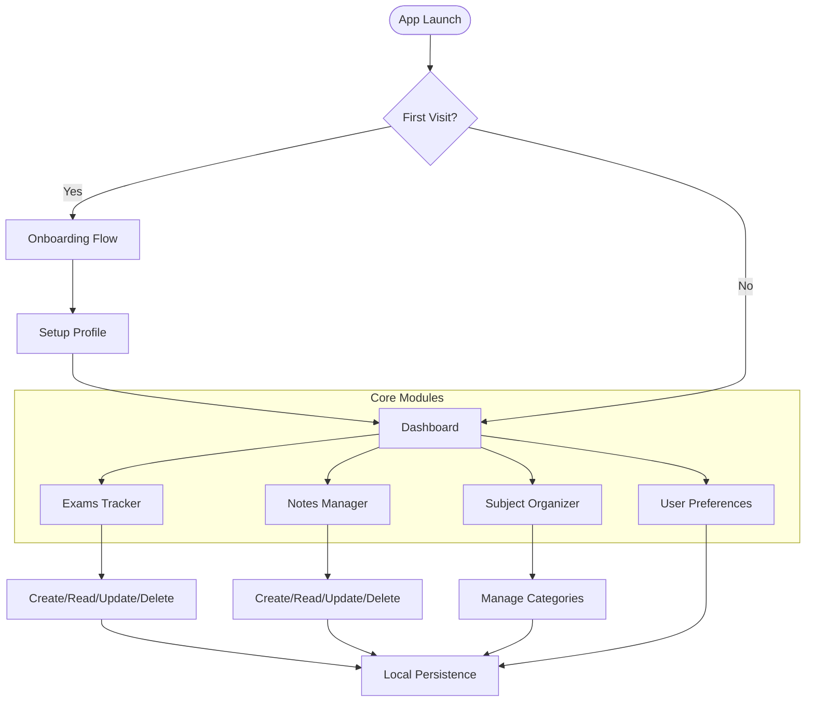
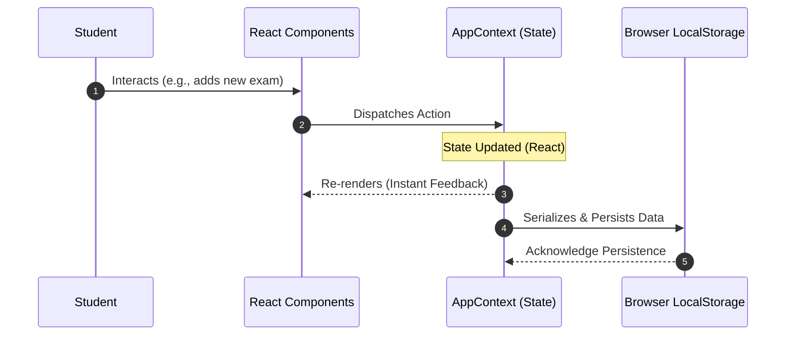

<div align="center">
  
  <h1>ExamFlow</h1>
  <p><strong>A premium mobile exam planner and notes management app for students.</strong></p>
  
  <p>
    <a href="https://examflow-ten.vercel.app/"><strong>Explore the Live Demo »</strong></a>
  </p>
  
  [](https://reactjs.org/)
  [](https://vitejs.dev/)
  [](https://tailwindcss.com/)
  [](https://www.typescriptlang.org/)
  [](https://www.framer.com/motion/)
</div>

<br />

## 📖 Overview

**ExamFlow** is a beautifully crafted, mobile-first web application designed to help students organize their academic life. It provides a seamless experience for tracking upcoming exams, managing study notes, and organizing subjects—all within a fluid, animated, and highly responsive user interface.

Built with modern web technologies, ExamFlow operates completely offline using local storage, ensuring your data is always accessible instantly.

---

## ✨ Key Features

- 📅 **Exam & Quiz Tracking**: Keep track of all your upcoming assessments with dates, times, and subject categorization.
- 📝 **Notes Management**: Create, edit, and organize study notes. Attach them to specific subjects for easy retrieval.
- 🗂️ **Subject Organization**: Color-coded subjects to visually separate your workload and keep everything organized.
- 🔔 **Smart Reminders**: Push notification integration to remind you of upcoming exams.
- 🌙 **Dark/Light Mode**: Beautifully designed themes that respect your system preferences.
- ⚡ **Offline-First**: All data is securely stored on your device using `localStorage`. No internet connection required!
- 🎨 **Fluid Animations**: Smooth page transitions and micro-interactions powered by Framer Motion.

---

## 🗺️ Roadmap

- [ ] **Cloud Sync**: Optional cloud backup using Firebase or Supabase.
- [ ] **PDF Export**: Export your study notes as professional PDF documents.
- [ ] **Study Timer**: Integrated Pomodoro timer to boost productivity.
- [ ] **Collaborative Notes**: Share notes with classmates via unique links.

---

## 📸 Screenshots

*(Note: These are illustrative placeholders. Replace with actual screenshots of the app)*

<div align="center">
  
  
</div>

---

## 🧠 Core Concepts

### 1. State Management (Context API)
ExamFlow utilizes React's Context API (`AppContext.tsx`) to manage global state. This avoids prop-drilling and provides a centralized store for:
- User Profile & Onboarding Status
- Exams & Quizzes
- Notes & Subjects
- Theme & Notification Preferences

### 2. Data Persistence (Local Storage)
To provide a fast, offline-first experience, all state is synchronized with the browser's `localStorage`. 
- **Read**: State initializes from `localStorage` on app load.
- **Write**: Any state mutation (adding an exam, updating a note) triggers a `localStorage.setItem` update.

### 3. Mobile-First UI/UX
The application is designed specifically for mobile devices. It uses a bottom navigation bar, touch-friendly tap targets (min 44px), and swipeable interfaces. Tailwind CSS is used to enforce consistent spacing, typography, and color palettes.

### 4. Fluid Animations
Using `framer-motion`, the app features:
- **Page Transitions**: Smooth fade and slide effects when navigating between tabs.
- **List Animations**: Staggered layout animations when adding or removing items from lists.
- **Micro-interactions**: Scale effects on button presses to provide tactile feedback.

---

## 🏗️ Architecture & Technical Design

### System Overview

ExamFlow is designed as a **Decentralized Client-Side Application**. It leverages the browser's native capabilities to provide a high-performance, low-latency experience without the need for a traditional backend.

### User Journey Flowchart



### Data Synchronization Strategy

The application follows an **Optimistic UI** pattern. State changes are reflected instantly in the React tree, while a background process ensures the data is mirrored to `localStorage`.



---

## 📂 Project Structure

```text
ExaMFloW/
├── public/             # Static assets
├── src/
│   ├── components/     # Reusable UI components (Buttons, Cards, etc.)
│   ├── context/        # AppContext for global state management
│   ├── pages/          # Main application views (Dashboard, Exams, etc.)
│   ├── types/          # TypeScript interfaces and types
│   ├── App.tsx         # Main application routing and layout
│   ├── main.tsx        # Entry point
│   └── index.css       # Global styles (Tailwind CSS)
├── package.json        # Dependencies and scripts
├── tailwind.config.js  # Tailwind CSS configuration
└── vite.config.ts      # Vite configuration
```

---

## 🚀 Getting Started

### Prerequisites
- Node.js (v18 or higher)
- npm or yarn

### Installation

1. **Clone the repository** (or download the source code):
   ```bash
   git clone https://github.com/rehan9703/ExaMFloW.git
   cd ExaMFloW
   ```

2. **Install dependencies**:
   ```bash
   npm install
   ```

3. **Start the development server**:
   ```bash
   npm run dev
   ```

4. **Open your browser**:
   Navigate to `http://localhost:3000` to view the app.

---

## 🛠️ Tech Stack

- **Framework**: [React 19](https://react.dev/)
- **Build Tool**: [Vite 6](https://vitejs.dev/)
- **Styling**: [Tailwind CSS v4](https://tailwindcss.com/)
- **Icons**: [Lucide React](https://lucide.dev/)
- **Animations**: [Framer Motion](https://www.framer.com/motion/)
- **Language**: [TypeScript](https://www.typescriptlang.org/)

---

## 🌍 Deployment

ExamFlow is a static Single Page Application (SPA), making it incredibly easy to deploy to any static hosting provider.

### Vercel (Recommended)
1. Push your code to GitHub.
2. Import the project in Vercel.
3. Vercel will automatically detect Vite. Click **Deploy**.

### Render
1. Create a new **Static Site** on Render.
2. Connect your repository.
3. Build Command: `npm run build`
4. Publish Directory: `dist`
5. Add a Rewrite Rule: `/*` -> `/index.html`

### Railway
1. Create a new project and deploy from your GitHub repo.
2. Railway will automatically build the project using Nixpacks.

---

## 👥 Contributors

<div align="center">
  <a href="https://github.com/rehan9703">
    
    <br />
    <sub><b>rehan9703</b></sub>
  </a>
</div>

---

## 📄 License

This project is licensed under the MIT License - see the LICENSE file for details.

---
<div align="center">
  <p>Built with ❤️ for students everywhere.</p>
</div>
